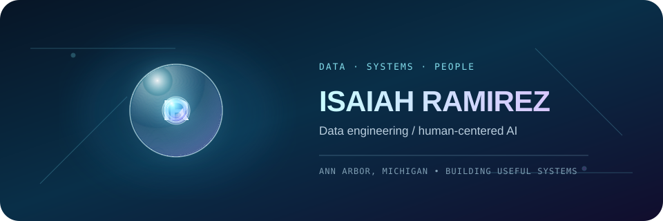

  
   
  Click the data core for the interactive liquid-glass version.

## About me

I’m **Isaiah Ramirez**, a developer and Information Analysis student at the University of Michigan focused on data engineering, human-centered AI, and full-stack development. I build practical applications using Python, SQL, JavaScript, React, FastAPI, and modern data tools.

My work includes AI-powered search systems, data-analysis platforms, interactive 3D web experiences, and accessible user-centered products. I enjoy turning complex ideas and messy datasets into polished, useful software.

  
  
  

## What I build with

**Core**  
     

**Applications & APIs**  
     

**Data & machine learning**  
     

**Cloud, delivery & creative tools**  
     

## GitHub activity

  
  
   
  

  
<strong>More activity, trophies, and a dev quote</strong>

   
  
  
  

  
  

Interactive hero built with <a href="https://github.com/dashersw/liquid-glass-js">liquid-glass-js</a> (MIT). The README animation uses a GitHub-safe SVG fallback.
